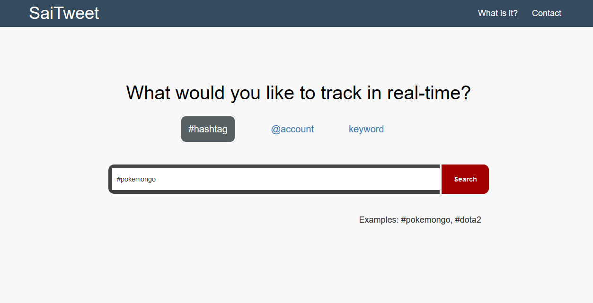
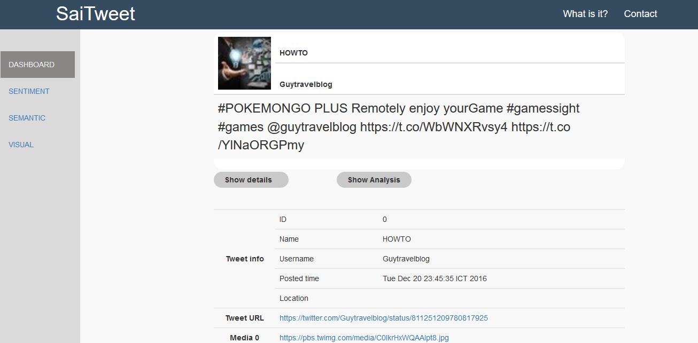
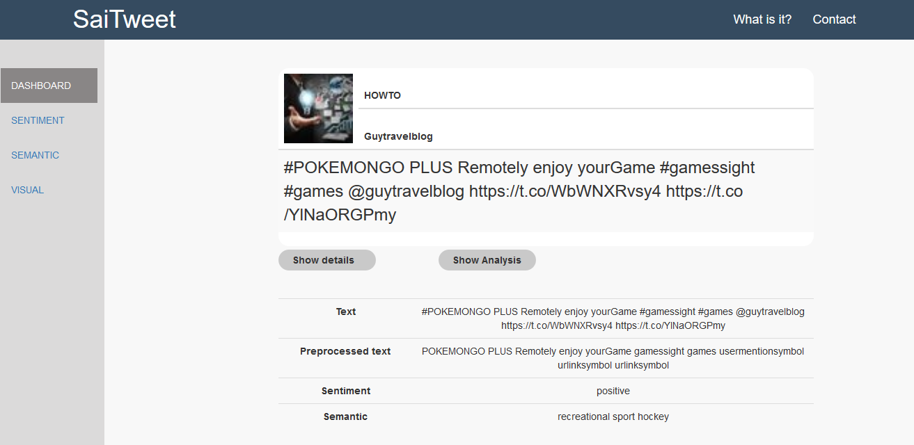
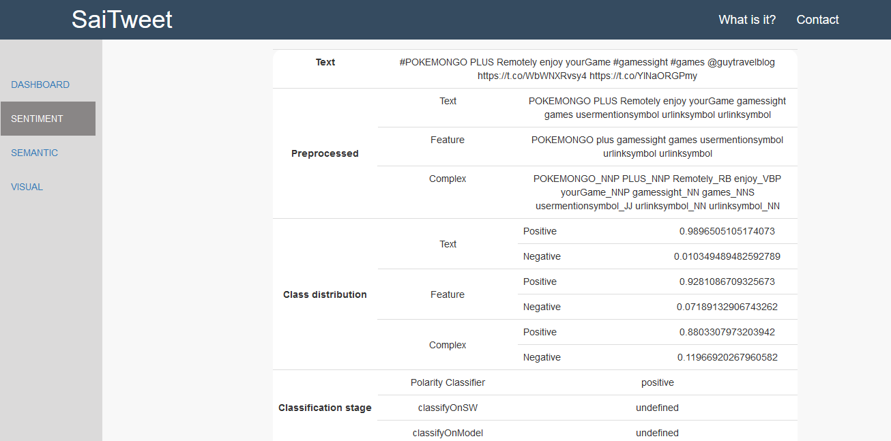
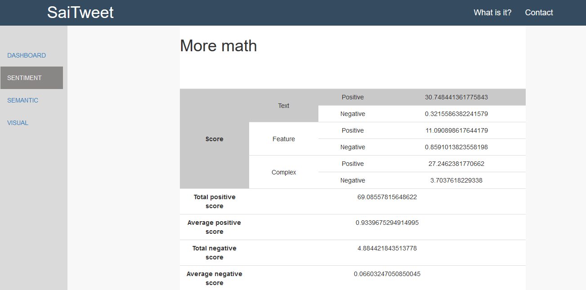
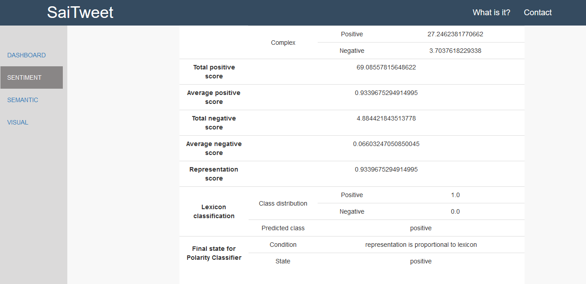
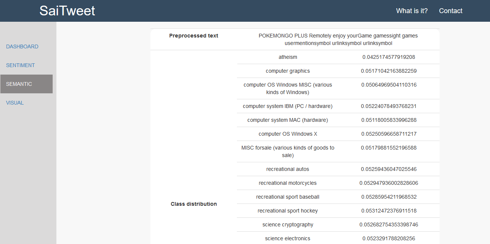
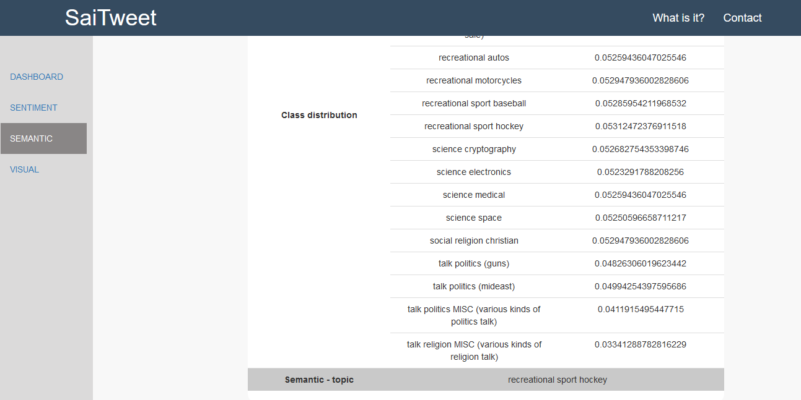

# sentiment-analysis-twitter

### Code name: SaiTweet

-----

## Programming Languages

<ul>
	<li>Java (JSP, Servlet)</li>
	<li>HTML, CSS, Javascript</li>
</ul>

## Frameworks and Libraries

<ul>
	<li>WEKA</li>
	<li>AngularJS</li>
	<li>Bootstrap</li>
	<li>jQuery</li>
	<li>twitter4j (Java library for the Twitter API)</li>
</ul>

## General Concept

<ul>
	<li><b>Extracts Twitter Data</b>
		<ul>
			<li>Sets the query</li>
			<li>Extract tweet</li>
			<li>Sets the tweet text</li>
			<li>Set the amount of tweet</li>
		</ul>
	</li>
	<li><b>Sentiment Analysis</b>
		<ul>
			<li>Initializes Sentiment Processor
				<ul>
					<li>Sentiment Analyser
						<ul>
							<li>Trainer
								<ul>
									<li>Initializes BidiMap objects for text, feature, and complex representation</li>
									<li>Trains lexicon model</li>
									<li>Trains text model</li>
									<li>Trains feature model</li>
									<li>Trains complex model</li>
								</ul>
							</li>
							<li>Polarity Classifier
								<ul>
									<li>Initializes BidiMap objects for text, feature, and complex representation</li>
									<li>Initializes filter (StringToWordVector)</li>
									<li>Initializes tokenizer (NGramTokenizer)</li>
									<li>Initializes classifiers (MNB and LibSVM)</li>
								</ul>
							</li>
							<li>Tweet Preprocessor
								<ul>
									<li>Initializes preprocessor for lexicon, text, feature, and complex representation</li>
									<li>Initializes Part of Speech (POS) tagger</li>
								</ul>
							</li>
							<li>Initializes filterer (StringToWordVector) and tokenizer (NGramTokenizer)</li>
							<li>Initializes data train and data test in case of we need to use sliding window</li>
						</ul>
					</li>
					<li>Tweet initialization
						<ul>
							<li>Initializes the list of tweet sentiment</li>
							<li>Initializes the list of preprocessed tweet</li>
							<li>Initializes the list of class distribution</li>
							<li>Initializes the list of predicted class</li>
						</ul>
					</li>
					<li>Get Polarity
						<ul>
							<li>Preprocesses the lexicon, text, feature, and complex</li>
							<li>Initializes the instances (data test) of lexicon, text, feature, and complex</li>
						</ul>
					</li>
					<li>Execution of Algorithm
						<ul>
							<li>Gets the instances of every data test representation and applies a filter to it</li>
							<li>Reformates the instances of lexicon, text, feature, and complex
								<ul>
									<li>Removes the attributes from the data test that are not used in the data train</li>
								</ul>
							</li>
							<li>Apply the classifier
								<ul>
									<li>Classifier for text, feature, and complex representation (HC)
										<ul>
											<li>Gets the probability for each class (positive/negative)</li>
											<li>Uses double[] preds = mnb_classifiers[i].distributionForInstance(test.get(0))</li>
											<li>Text-based representation
												<ul>
													<li>Distribution for positive (hc[0]): preds[0]*31.07</li>
													<li>Distribution for negative (hc[1]): preds[1]*31.07</li>
												</ul>
											</li>
											<li>Feature-based representation
												<ul>
													<li>Distribution for positive (hc[2]): preds[0]*11.95</li>
													<li>Distribution for negative (hc[3]): preds[1]*11.95</li>
												</ul>
											</li>
											<li>Complex-based representation
												<ul>
													<li>Distribution for positive (hc[4]): preds[0]*30.95</li>
													<li>Distribution for negative (hc[5]): preds[1]*30.95</li>
												</ul>
											</li>
										</ul>
									</li>
									<li>Classifier for lexicon representation (LC)
										<ul>
											<li>Gets the probability for each class (positive/negative)</li>
											<li>Presumes that the value is stored in a variable called lc_value</li>
										</ul>
									</li>
									<li>Counts the probabilities
										<ul>
											<li>HC classifier 
												<ul>
													<li>Positive score (ps): (hc[0] + hc[2] + hc[4]) / 73.97</li>
													<li>Negative score (ns): (hc[1] + hc[3] + hc[5]) / 73.97</li>
													<li>Final score (hc_value): (1 + ps - ns) / 2</li>
												</ul>
											</li>
											<li>Comparison between HC and LC 
												<ul>
													<li>If hc_value < 0.5 AND lc_value > 0.5: output is negative</li>
													<li>Else if hc_value > 0.5 AND lc_value < 0.5: output is positive</li>
													<li>Else: output is nan</li>
												</ul>
											</li>
										</ul>
									</li>
								</ul>
							</li>
							<li>Check the Sliding Window
								<ul>
									<li>Case 0: uses sliding window
										<ul>
											<li>If HC and LC agree (positive/negative), then put this document in the data train</li>		
											<li>Else, add the document into the data test. It will be classified in the end of the process
												<ul>
													<li>If the number of data train's instances is more than 0 
														<ul>
															<li>Calls clarifyOnSlidingWindow
																<ul>
																	<li>Adds an instance into the data train at the end of file</li>
																	<li>Sets a filter for the data train and store the filtered data train in a new instances</li>
																	<li>Prepares the data train and the data test</li>
																	<li>Builds classifier from the data train (1000 training data)</li>
																	<li>Predicts the class based on the model created before</li>
																</ul>
															</li>
														</ul>
													</li>
													<li>Else, the final class is unknown for the data train is empty and can not do the training process</li>
												</ul>
											</li>
										</ul>
									</li>
									<li>Case 1: does not use sliding window
										<ul>
											<li>If HC and LC agree (positive/negative), then sets the list of predicted class come from three possibilities</li>
											<li>Else,
												<ul>
													<li>Calls clarifyOnModel which decides upon a "disagreed" (output class = nan) document by applying the learned model based on the previously built model
														<ul>
															<li>Gets the text-based representation of the document</li>
															<li>Re-orders attributes so that they are compatible with the data train</li>
															<li>Finds the polarity of the document based on the previously built model, namely Liebherr, goethe, or Cisco</li>
														</ul>
													</li>
												</ul>
											</li>
										</ul>
									</li>
								</ul>
							</li>
							<li>
								Done
							</li>
						</ul>
					</li>
				</ul>
			</li>
		</ul>
	</li>
	<li><b>Semantic Analysis</b>
		<ul>
			<li>Runner
				<ul>
					<li>Initializes preprocessed tweet</li>
					<li>Initializes the list of semantic value</li>
					<li>Initializes the list of class distribution for semantic</li>
					<li>Classifies tweet's semantic</li>
				</ul>
			</li>
			<li>Trainer
				<ul>
					<li>Load dataset</li>
					<li>Initializes filterer (StringToWordVector) and tokenizer (NGramTokenizer)</li>
					<li>Build the model using NaiveBayes classifier</li>
					<li>Save the model</li>
				</ul>
			</li>
			<li>Classifier
				<ul>
					<li>Load model</li>
					<li>Creates the attributes, class and text (instances)</li>
					<li>Classifies the instance based on the saved model</li>
				</ul>
			</li>
		</ul>
	</li>
	<li><b>Visual Data (PieChart)</b>
		<ul>
			<li>Starts the visualization</li>
			<li>Gets the number of positive and negative sentiment</li>
			<li>Initializes PieChart attributes</li>
			<li>Draws the PieChart</li>
		</ul>
	</li>
</ul>

## Project Display

**Query page - write the query based on the type of keyword**

 

**Dashboard - shows the details of tweet**

 

**Dashboard - shows the brief info of sentiment and semantic analysis**

 

**Sentiment Analysis - shows the information about the text preprocessing, the class distribution, and the classification stage**

 

**Sentiment Analysis - shows the information about the total score for every representation, the total and average score for every class, and the final score for polarity classification**

 

**Semantic Analysis - shows the information about the probability distribution for every sentiment class**

 

**Semantic Analysis - shows the information about the semantic class**

 

## References

Thanks to **Petter Törnberg (Copyright 2013)** for the demo code used to analyze the sentiment value of a word. I implemented the code on **SWN3.java** with several modifications. 

 

You can find the original code [here](sentiwordnet.isti.cnr.it)

 

You can read the theories behind the production of this application from these resources: 
<ul>
	<li><a href="https://www.researchgate.net/publication/269093520_Feature_based_sentiment_analysis">https://www.researchgate.net/publication/269093520_Feature_based_sentiment_analysis</a></li>
	<li><a href="https://cs.nyu.edu/grishman/jet/guide/PennPOS.html">https://cs.nyu.edu/grishman/jet/guide/PennPOS.html</a></li>
	<li><a href="http://partofspeech.org/">http://partofspeech.org/</a></li>
	<li><a href="http://www.slideshare.net/Cataldo/aiia-14dart">http://www.slideshare.net/Cataldo/aiia-14dart</a></li>
</ul>
